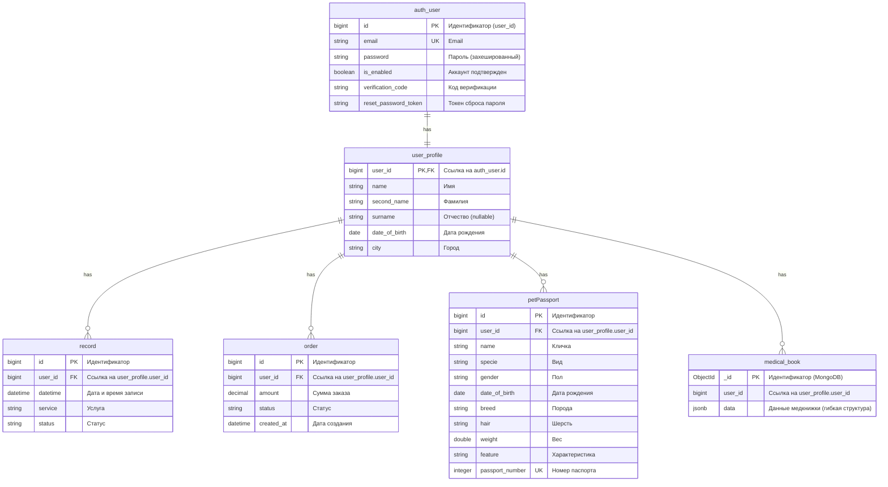

```mermaid
erDiagram
  auth_user ||--|| user_profile : has
    user_profile ||--o{ record : has
    user_profile ||--o{ order : has
    user_profile ||--o{ petPassport : has
    user_profile ||--o{ medical_book : has

    auth_user {
        bigint id PK "Идентификатор (user_id)"
        string email UK "Email"
        string password "Пароль (захешированный)"
        boolean is_enabled "Аккаунт подтвержден"
        string verification_code "Код верификации"
        string reset_password_token "Токен сброса пароля"
    }

    user_profile {
        bigint user_id PK,FK "Ссылка на auth_user.id"
        string name "Имя"
        string second_name "Фамилия"
        string surname "Отчество (nullable)"
        date date_of_birth "Дата рождения"
        string city "Город"
    }

    record {
        bigint id PK "Идентификатор"
        bigint user_id FK "Ссылка на user_profile.user_id"
        datetime datetime "Дата и время записи"
        string service "Услуга"
        string status "Статус"
    }

    order {
        bigint id PK "Идентификатор"
        bigint user_id FK "Ссылка на user_profile.user_id"
        decimal amount "Сумма заказа"
        string status "Статус"
        datetime created_at "Дата создания"
    }

    petPassport {
        bigint id PK "Идентификатор"
        bigint user_id FK "Ссылка на user_profile.user_id"
        string name "Кличка"
        string specie "Вид"
        string gender "Пол"
        date date_of_birth "Дата рождения"
        string breed "Порода"
        string hair "Шерсть"
        double weight "Вес"
        string feature "Характеристика"
        integer passport_number UK "Номер паспорта"
    }

    medical_book {
        ObjectId _id PK "Идентификатор (MongoDB)"
        bigint user_id "Ссылка на user_profile.user_id"
        jsonb data "Данные медкнижки (гибкая структура)"
    }
```
